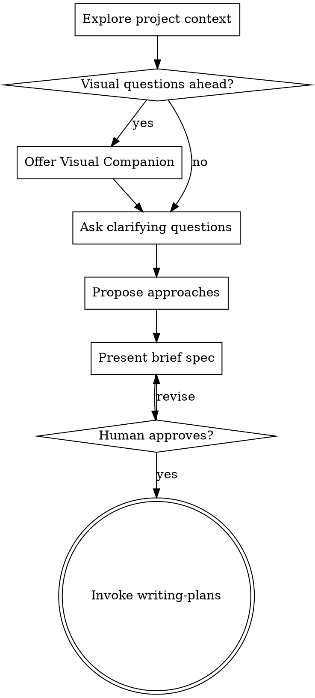

# Brainstorming Brief Specs

Turn an issue description or human prompt into a brief spec through conversation. The output is shared in the current conversation, issue, or pull request discussion when tooling supports it. Do not create repository spec artifacts by default.

<HARD-GATE>
Do NOT invoke an implementation skill, write code, scaffold a project, or take implementation action until you have presented a brief spec and the human partner has approved it.
</HARD-GATE>

## Checklist

Create a task for each item and complete them in order:

1. **Explore project context** - check files, docs, issue text, pull request discussion, and recent commits.
2. **Offer visual companion** - only if upcoming questions are visual; see Visual Companion.
3. **Ask clarifying questions** - one at a time, focused on purpose, constraints, and success criteria.
4. **Propose 2-3 approaches** - include trade-offs and a recommendation.
5. **Present a brief spec** - problem, scope, non-goals, acceptance criteria, implementation shape, and verification.
6. **Get human approval** - revise until approved.
7. **Transition to implementation planning** - invoke `writing-plans` to create a temporary plan.

## Process Flow



## Input Sources

- **Existing issue:** Treat the issue description and comments as the starting context. If tools allow, comment with the approved brief spec or update the issue using the repository's process.
- **Human prompt:** Do not require an issue. If an issue would help coordination, offer it as an option, not a gate.
- **Pull request discussion:** Use review comments and questions as requirements to refine the brief spec before additional implementation.

## Brief Spec Format

Keep the brief spec short enough to review in one pass:

```markdown
**Problem:** What user-visible or maintainer-visible problem are we solving?
**Scope:** What will change?
**Non-Goals:** What will not change?
**Acceptance Criteria:** Observable outcomes that show the work is done.
**Implementation Shape:** Main components/files likely to change.
**Verification:** Tests, checks, or manual evidence needed.
```

## Working In Existing Codebases

- Explore current structure before proposing changes.
- Follow existing patterns unless they directly block the requested work.
- Include targeted cleanup only when it supports the current goal.
- Keep units small enough to explain by responsibility and public behavior.

## Red Flags

**Never:**
- Create repository spec artifacts unless the human explicitly asks.
- Treat issue creation as mandatory for prompt-only work.
- Skip human approval because the change seems small.
- Transition to implementation with vague acceptance criteria.

**Always:**
- Ask one question at a time.
- Prefer multiple choice when it reduces friction.
- Present alternatives before recommending an approach.
- Move approved work into `writing-plans` as the next step.

## Visual Companion

A browser-based companion can show mockups, diagrams, and visual options during brainstorming. Use it only when seeing the answer is clearer than reading it.

**Offering the companion:** When upcoming questions involve visual content, offer it once in its own message:
> "Some of what we're working on might be easier to explain if I can show it to you in a web browser. I can put together mockups, diagrams, comparisons, and other visuals as we go. This feature is still new and can be token-intensive. Want to try it? (Requires opening a local URL)"

If they agree, read `skills/brainstorming/visual-companion.md` before using it.
